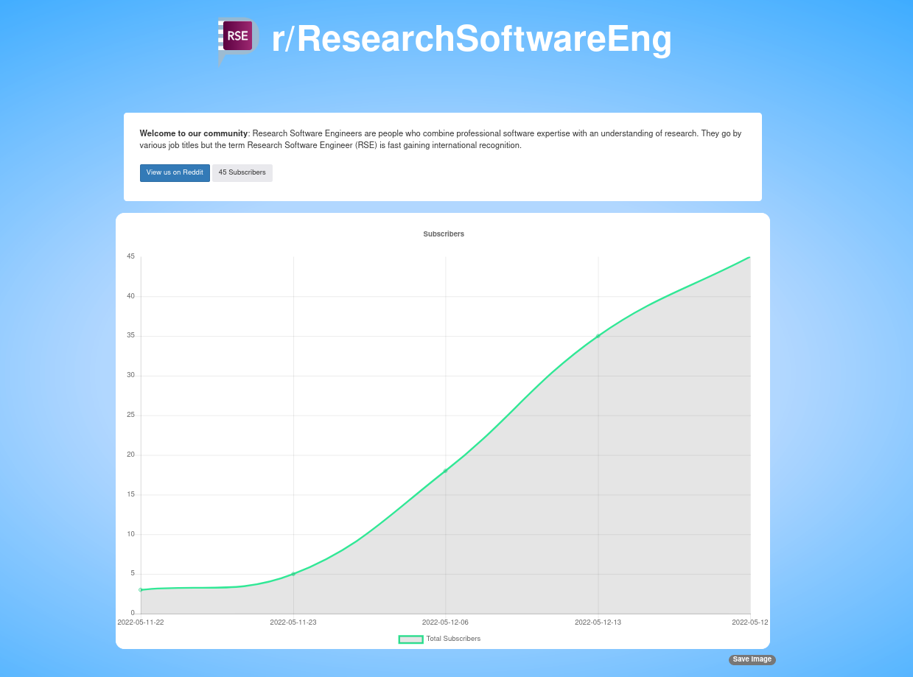

# ResearchSoftwareEng

Welcome to the stats graph for our [ResearchSoftwareEng](https://www.reddit.com/r/ResearchSoftwareEng/)
community! This is a fun little project where we can track our Reddit community over
time. ⭐️

## Usage

Hey, and you can use this to track your own reddit community!

1. Change the [COMMUNITY_NAME](COMMUNITY_NAME) file to match your community name
2. Tweak the _config.yaml with the name of your site.
3. If you want to use the reddit logo, comment out `logo:` in your config. Otherwise provide a path to a local image file.

And that's it! The workflow will retrieve updated data nightly (change to the frequency you want)
and then keep stats for each data point to render into a graph. The entire UI is also
using this same data.
